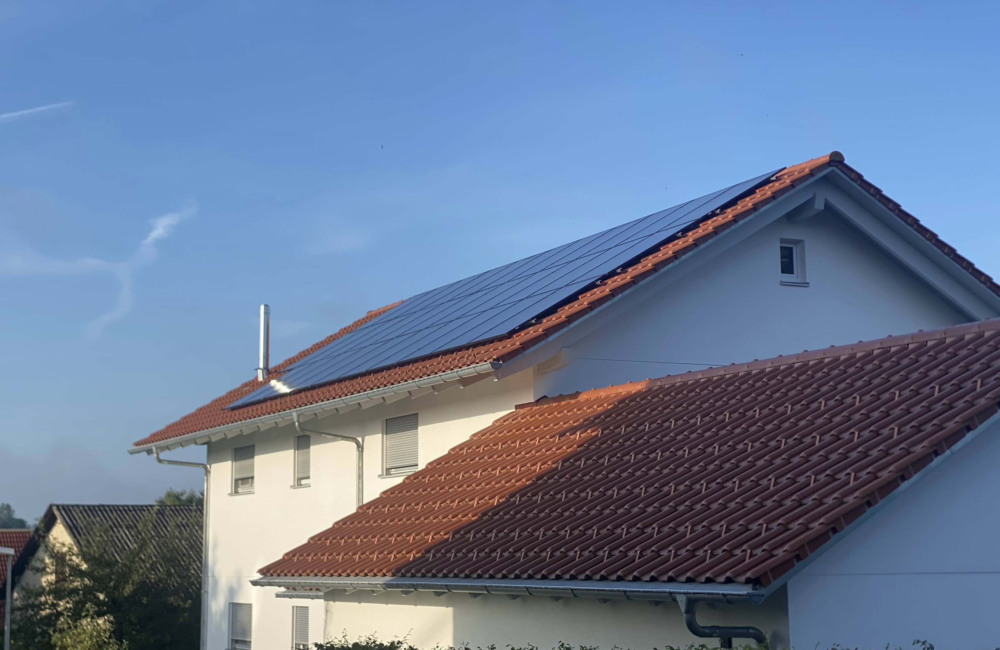
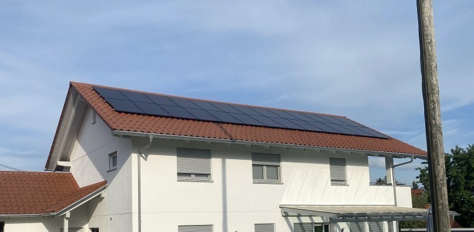

## Our Solar Installation

Since 07/2024 we have solar modules on our house.

### Overview

<Svg src="./energy-system.svg" />

### Power currently exported to the Grid

Currently <Topic topic="stefan/house/export_power_raw" /> W are exported to the grid (a negative number
means that power is imported from the grid).

### Exported energy today

Today, <Topic topic="stefan/house/daily_exported_energy" /> kWh have been exported to the grid in total.

### Total power generated

Since installation, the total PV generation is <Topic topic="stefan/house/total_pv_generation" /> kWh

### Inverters

More info on the inverters can be found [here](./inverters).

### Solar Panels

These are the solar panels:

#### East

#### West

### Battery

We have a battery with 16 kWh capacity. More info can be found [here](./battery).

### Icon Attribution for SVG

The above SVG contains the following icons:

* "Solar Panel" icon by Best Mons from [Noun Project](https://thenounproject.com/browse/icons/term/Solar+panel)
* "Battery" icon by YANDI RS from [Noun Project](https://thenounproject.com/browse/icons/term/battery)
* "House" icon by Candy Design from [Noun Project](https://thenounproject.com/browse/icons/term/house)
* "Power Line" icon by Dmitry Vasiliev from [Noun Project](https://thenounproject.com/browse/icons/term/power-line)
