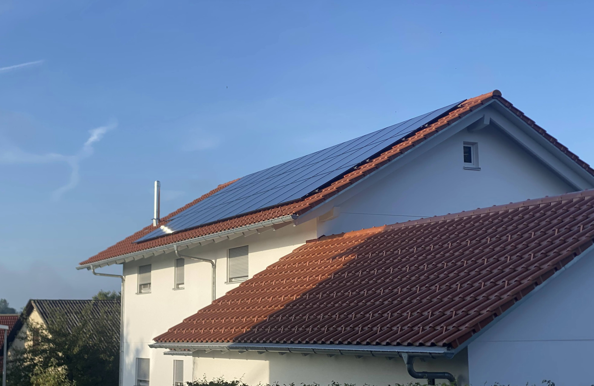

## Our Solar Installation

Since 07/2024 we have solar modules on our house.

### Power currently exported to the Grid

Currently <Topic topic="export_power_raw" W are exported to the grid.

### Exported energy today

Today, <Topic topic="daily_exported_energy" /> kWh have been exported to the grid in total.

### Total power generated

Since installation, the total PV generation is <Topic topic="total_pv_generation" /> kWh

### Inverters

More info on the inverters can be found [here](./inverters)

### Solar Panels

These are the solar panels:

#### East

#### West

### Battery

We have a battery with 16 kWh capacity. More info can be found [here](./battery)
