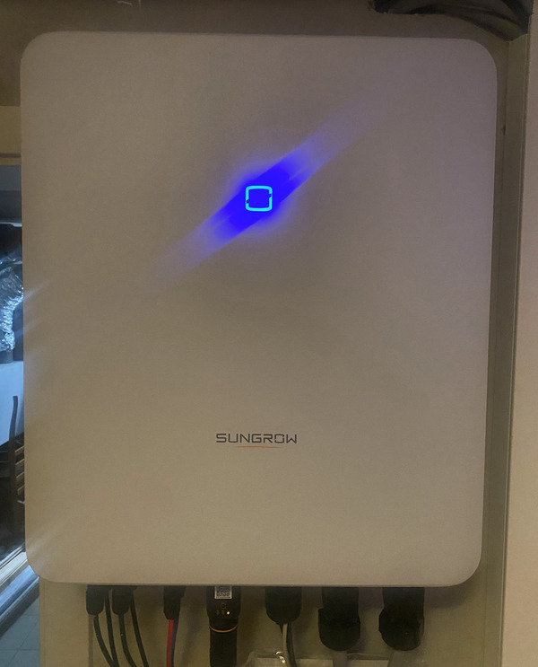

## Inverters

Here are the inverters:

### Inverter 1

Current power: <Topic topic="inverters/inv1_total_dc_power" /> W

### Inverter 2

Current power: <Topic topic="inverters/inv2_total_dc_power" /> W

